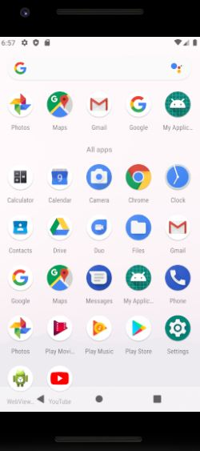
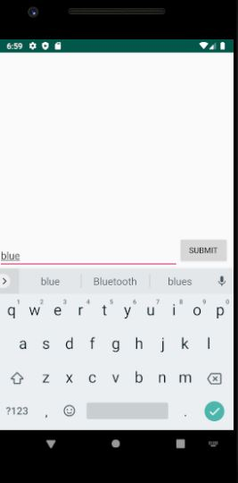

# My Color Application

## Welcome to My Color Application!

>This is a an Android app made with Android 4.4 (KitKat). I've run this on a Pixel 2 with Android 9.0x86 (Pie).

>Code used for this is: Java

>Editor used was: Android Studio

What does this app do? Simply put, it does this:
- Once user launches the app, the will be prompted with a queston (just the one).
- Then after the user answers the question, the app will generate a response

To use this app, you will need to download and open with Android Studio. Once there you will need to use the AVD manager to use an android phone emulator.

Screen shots of the app are below:

 
 

